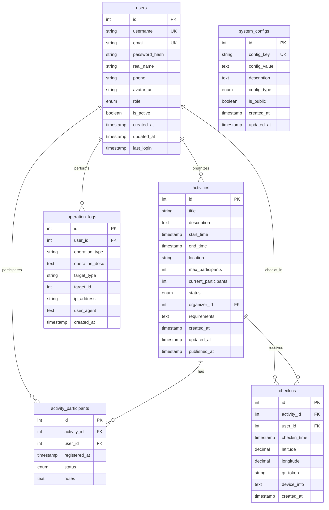

# 附录C：数据库设计文档

## C.1 数据库概述

### C.1.1 数据库选型
- **数据库类型**: SQLite（开发环境）/ MySQL（生产环境）
- **字符集**: UTF-8
- **排序规则**: utf8_general_ci
- **存储引擎**: InnoDB（MySQL）

### C.1.2 设计原则
- 遵循第三范式，减少数据冗余
- 合理设置主键和外键约束
- 建立适当的索引提高查询性能
- 考虑数据完整性和一致性

## C.2 数据表结构

### C.2.1 用户表（users）
```sql
CREATE TABLE users (
    id INTEGER PRIMARY KEY AUTOINCREMENT,
    username VARCHAR(50) NOT NULL UNIQUE,
    email VARCHAR(100) NOT NULL UNIQUE,
    password_hash VARCHAR(255) NOT NULL,
    real_name VARCHAR(50),
    phone VARCHAR(20),
    avatar_url VARCHAR(255),
    role ENUM('admin', 'volunteer') DEFAULT 'volunteer',
    is_active BOOLEAN DEFAULT TRUE,
    created_at TIMESTAMP DEFAULT CURRENT_TIMESTAMP,
    updated_at TIMESTAMP DEFAULT CURRENT_TIMESTAMP,
    last_login TIMESTAMP
);

-- 索引
CREATE INDEX idx_users_username ON users(username);
CREATE INDEX idx_users_email ON users(email);
CREATE INDEX idx_users_role ON users(role);
CREATE INDEX idx_users_created_at ON users(created_at);
```

**字段说明**:
| 字段名 | 类型 | 约束 | 说明 |
|--------|------|------|------|
| id | INTEGER | PRIMARY KEY | 用户唯一标识 |
| username | VARCHAR(50) | NOT NULL, UNIQUE | 用户名 |
| email | VARCHAR(100) | NOT NULL, UNIQUE | 邮箱地址 |
| password_hash | VARCHAR(255) | NOT NULL | 密码哈希值 |
| real_name | VARCHAR(50) | | 真实姓名 |
| phone | VARCHAR(20) | | 手机号码 |
| avatar_url | VARCHAR(255) | | 头像URL |
| role | ENUM | DEFAULT 'volunteer' | 用户角色 |
| is_active | BOOLEAN | DEFAULT TRUE | 是否激活 |
| created_at | TIMESTAMP | DEFAULT CURRENT_TIMESTAMP | 创建时间 |
| updated_at | TIMESTAMP | DEFAULT CURRENT_TIMESTAMP | 更新时间 |
| last_login | TIMESTAMP | | 最后登录时间 |

### C.2.2 活动表（activities）
```sql
CREATE TABLE activities (
    id INTEGER PRIMARY KEY AUTOINCREMENT,
    title VARCHAR(200) NOT NULL,
    description TEXT,
    start_time TIMESTAMP NOT NULL,
    end_time TIMESTAMP NOT NULL,
    location VARCHAR(200),
    max_participants INTEGER DEFAULT 0,
    current_participants INTEGER DEFAULT 0,
    status ENUM('draft', 'published', 'cancelled', 'completed') DEFAULT 'draft',
    organizer_id INTEGER NOT NULL,
    requirements TEXT,
    created_at TIMESTAMP DEFAULT CURRENT_TIMESTAMP,
    updated_at TIMESTAMP DEFAULT CURRENT_TIMESTAMP,
    published_at TIMESTAMP,
    
    FOREIGN KEY (organizer_id) REFERENCES users(id) ON DELETE CASCADE
);

-- 索引
CREATE INDEX idx_activities_status ON activities(status);
CREATE INDEX idx_activities_organizer ON activities(organizer_id);
CREATE INDEX idx_activities_start_time ON activities(start_time);
CREATE INDEX idx_activities_created_at ON activities(created_at);
```

**字段说明**:
| 字段名 | 类型 | 约束 | 说明 |
|--------|------|------|------|
| id | INTEGER | PRIMARY KEY | 活动唯一标识 |
| title | VARCHAR(200) | NOT NULL | 活动标题 |
| description | TEXT | | 活动描述 |
| start_time | TIMESTAMP | NOT NULL | 开始时间 |
| end_time | TIMESTAMP | NOT NULL | 结束时间 |
| location | VARCHAR(200) | | 活动地点 |
| max_participants | INTEGER | DEFAULT 0 | 最大参与人数 |
| current_participants | INTEGER | DEFAULT 0 | 当前参与人数 |
| status | ENUM | DEFAULT 'draft' | 活动状态 |
| organizer_id | INTEGER | NOT NULL | 组织者ID |
| requirements | TEXT | | 参与要求 |
| created_at | TIMESTAMP | DEFAULT CURRENT_TIMESTAMP | 创建时间 |
| updated_at | TIMESTAMP | DEFAULT CURRENT_TIMESTAMP | 更新时间 |
| published_at | TIMESTAMP | | 发布时间 |

### C.2.3 活动参与表（activity_participants）
```sql
CREATE TABLE activity_participants (
    id INTEGER PRIMARY KEY AUTOINCREMENT,
    activity_id INTEGER NOT NULL,
    user_id INTEGER NOT NULL,
    registered_at TIMESTAMP DEFAULT CURRENT_TIMESTAMP,
    status ENUM('registered', 'cancelled', 'completed') DEFAULT 'registered',
    notes TEXT,
    
    FOREIGN KEY (activity_id) REFERENCES activities(id) ON DELETE CASCADE,
    FOREIGN KEY (user_id) REFERENCES users(id) ON DELETE CASCADE,
    UNIQUE(activity_id, user_id)
);

-- 索引
CREATE INDEX idx_participants_activity ON activity_participants(activity_id);
CREATE INDEX idx_participants_user ON activity_participants(user_id);
CREATE INDEX idx_participants_status ON activity_participants(status);
CREATE INDEX idx_participants_registered_at ON activity_participants(registered_at);
```

**字段说明**:
| 字段名 | 类型 | 约束 | 说明 |
|--------|------|------|------|
| id | INTEGER | PRIMARY KEY | 参与记录唯一标识 |
| activity_id | INTEGER | NOT NULL | 活动ID |
| user_id | INTEGER | NOT NULL | 用户ID |
| registered_at | TIMESTAMP | DEFAULT CURRENT_TIMESTAMP | 报名时间 |
| status | ENUM | DEFAULT 'registered' | 参与状态 |
| notes | TEXT | | 备注信息 |

### C.2.4 签到记录表（checkins）
```sql
CREATE TABLE checkins (
    id INTEGER PRIMARY KEY AUTOINCREMENT,
    activity_id INTEGER NOT NULL,
    user_id INTEGER NOT NULL,
    checkin_time TIMESTAMP DEFAULT CURRENT_TIMESTAMP,
    latitude DECIMAL(10, 8),
    longitude DECIMAL(11, 8),
    qr_token VARCHAR(100),
    device_info TEXT,
    created_at TIMESTAMP DEFAULT CURRENT_TIMESTAMP,
    
    FOREIGN KEY (activity_id) REFERENCES activities(id) ON DELETE CASCADE,
    FOREIGN KEY (user_id) REFERENCES users(id) ON DELETE CASCADE,
    UNIQUE(activity_id, user_id)
);

-- 索引
CREATE INDEX idx_checkins_activity ON checkins(activity_id);
CREATE INDEX idx_checkins_user ON checkins(user_id);
CREATE INDEX idx_checkins_time ON checkins(checkin_time);
CREATE INDEX idx_checkins_qr_token ON checkins(qr_token);
```

**字段说明**:
| 字段名 | 类型 | 约束 | 说明 |
|--------|------|------|------|
| id | INTEGER | PRIMARY KEY | 签到记录唯一标识 |
| activity_id | INTEGER | NOT NULL | 活动ID |
| user_id | INTEGER | NOT NULL | 用户ID |
| checkin_time | TIMESTAMP | DEFAULT CURRENT_TIMESTAMP | 签到时间 |
| latitude | DECIMAL(10, 8) | | 纬度 |
| longitude | DECIMAL(11, 8) | | 经度 |
| qr_token | VARCHAR(100) | | 二维码令牌 |
| device_info | TEXT | | 设备信息 |
| created_at | TIMESTAMP | DEFAULT CURRENT_TIMESTAMP | 创建时间 |

### C.2.5 系统配置表（system_configs）
```sql
CREATE TABLE system_configs (
    id INTEGER PRIMARY KEY AUTOINCREMENT,
    config_key VARCHAR(100) NOT NULL UNIQUE,
    config_value TEXT,
    description TEXT,
    config_type ENUM('string', 'number', 'boolean', 'json') DEFAULT 'string',
    is_public BOOLEAN DEFAULT FALSE,
    created_at TIMESTAMP DEFAULT CURRENT_TIMESTAMP,
    updated_at TIMESTAMP DEFAULT CURRENT_TIMESTAMP
);

-- 索引
CREATE INDEX idx_configs_key ON system_configs(config_key);
CREATE INDEX idx_configs_public ON system_configs(is_public);
```

**字段说明**:
| 字段名 | 类型 | 约束 | 说明 |
|--------|------|------|------|
| id | INTEGER | PRIMARY KEY | 配置项唯一标识 |
| config_key | VARCHAR(100) | NOT NULL, UNIQUE | 配置键 |
| config_value | TEXT | | 配置值 |
| description | TEXT | | 配置描述 |
| config_type | ENUM | DEFAULT 'string' | 配置类型 |
| is_public | BOOLEAN | DEFAULT FALSE | 是否公开 |
| created_at | TIMESTAMP | DEFAULT CURRENT_TIMESTAMP | 创建时间 |
| updated_at | TIMESTAMP | DEFAULT CURRENT_TIMESTAMP | 更新时间 |

### C.2.6 操作日志表（operation_logs）
```sql
CREATE TABLE operation_logs (
    id INTEGER PRIMARY KEY AUTOINCREMENT,
    user_id INTEGER,
    operation_type VARCHAR(50) NOT NULL,
    operation_desc TEXT,
    target_type VARCHAR(50),
    target_id INTEGER,
    ip_address VARCHAR(45),
    user_agent TEXT,
    created_at TIMESTAMP DEFAULT CURRENT_TIMESTAMP,
    
    FOREIGN KEY (user_id) REFERENCES users(id) ON DELETE SET NULL
);

-- 索引
CREATE INDEX idx_logs_user ON operation_logs(user_id);
CREATE INDEX idx_logs_type ON operation_logs(operation_type);
CREATE INDEX idx_logs_target ON operation_logs(target_type, target_id);
CREATE INDEX idx_logs_created_at ON operation_logs(created_at);
```

**字段说明**:
| 字段名 | 类型 | 约束 | 说明 |
|--------|------|------|------|
| id | INTEGER | PRIMARY KEY | 日志记录唯一标识 |
| user_id | INTEGER | | 操作用户ID |
| operation_type | VARCHAR(50) | NOT NULL | 操作类型 |
| operation_desc | TEXT | | 操作描述 |
| target_type | VARCHAR(50) | | 目标类型 |
| target_id | INTEGER | | 目标ID |
| ip_address | VARCHAR(45) | | IP地址 |
| user_agent | TEXT | | 用户代理 |
| created_at | TIMESTAMP | DEFAULT CURRENT_TIMESTAMP | 创建时间 |

## C.3 数据库关系图



## C.4 数据字典

### C.4.1 枚举值说明

**用户角色（role）**:
- `admin`: 管理员
- `volunteer`: 志愿者

**活动状态（status）**:
- `draft`: 草稿
- `published`: 已发布
- `cancelled`: 已取消
- `completed`: 已完成

**参与状态（status）**:
- `registered`: 已报名
- `cancelled`: 已取消
- `completed`: 已完成

**配置类型（config_type）**:
- `string`: 字符串
- `number`: 数字
- `boolean`: 布尔值
- `json`: JSON对象

### C.4.2 业务规则

1. **用户管理规则**:
   - 用户名和邮箱必须唯一
   - 密码必须经过哈希加密存储
   - 删除用户时，相关参与记录和签到记录级联删除

2. **活动管理规则**:
   - 活动开始时间必须早于结束时间
   - 当前参与人数不能超过最大参与人数
   - 只有管理员可以创建、修改、删除活动

3. **参与管理规则**:
   - 用户不能重复参与同一活动
   - 活动开始前可以取消参与
   - 活动结束后不能取消参与

4. **签到管理规则**:
   - 用户只能对已参与的活动进行签到
   - 每个活动每个用户只能签到一次
   - 签到需要提供位置信息

## C.5 索引优化

### C.5.1 主要索引
```sql
-- 用户表索引
CREATE INDEX idx_users_username ON users(username);
CREATE INDEX idx_users_email ON users(email);
CREATE INDEX idx_users_role ON users(role);

-- 活动表索引
CREATE INDEX idx_activities_status ON activities(status);
CREATE INDEX idx_activities_organizer ON activities(organizer_id);
CREATE INDEX idx_activities_start_time ON activities(start_time);

-- 参与记录表索引
CREATE INDEX idx_participants_activity ON activity_participants(activity_id);
CREATE INDEX idx_participants_user ON activity_participants(user_id);

-- 签到记录表索引
CREATE INDEX idx_checkins_activity ON checkins(activity_id);
CREATE INDEX idx_checkins_user ON checkins(user_id);
CREATE INDEX idx_checkins_time ON checkins(checkin_time);
```

### C.5.2 复合索引
```sql
-- 活动状态和时间复合索引
CREATE INDEX idx_activities_status_time ON activities(status, start_time);

-- 用户参与活动复合索引
CREATE INDEX idx_participants_user_activity ON activity_participants(user_id, activity_id);

-- 签到时间和活动复合索引
CREATE INDEX idx_checkins_time_activity ON checkins(checkin_time, activity_id);
```

## C.6 数据迁移脚本

### C.6.1 初始化脚本
```sql
-- 创建数据库
CREATE DATABASE volunteer_system CHARACTER SET utf8mb4 COLLATE utf8mb4_unicode_ci;

-- 使用数据库
USE volunteer_system;

-- 创建表结构（见上述表结构定义）
-- ...

-- 插入初始数据
INSERT INTO users (username, email, password_hash, role) VALUES 
('admin', 'admin@example.com', 'pbkdf2:sha256:260000$...', 'admin');

INSERT INTO system_configs (config_key, config_value, description, config_type, is_public) VALUES 
('site_name', '社区志愿者管理系统', '网站名称', 'string', TRUE),
('max_upload_size', '16777216', '最大上传文件大小（字节）', 'number', FALSE);
```

### C.6.2 升级脚本
```sql
-- 版本1.1升级脚本
ALTER TABLE activities ADD COLUMN image_url VARCHAR(255);

-- 版本1.2升级脚本
CREATE TABLE activity_categories (
    id INTEGER PRIMARY KEY AUTOINCREMENT,
    name VARCHAR(100) NOT NULL,
    description TEXT,
    created_at TIMESTAMP DEFAULT CURRENT_TIMESTAMP
);

ALTER TABLE activities ADD COLUMN category_id INTEGER;
ALTER TABLE activities ADD FOREIGN KEY (category_id) REFERENCES activity_categories(id);
```

## C.7 性能优化建议

### C.7.1 查询优化
1. 使用适当的索引
2. 避免SELECT *，只查询需要的字段
3. 使用LIMIT限制结果集大小
4. 合理使用JOIN操作

### C.7.2 存储优化
1. 定期清理过期数据
2. 压缩大文本字段
3. 使用合适的数据类型
4. 考虑数据分区

### C.7.3 维护建议
1. 定期备份数据库
2. 监控数据库性能
3. 定期更新统计信息
4. 检查并修复表碎片

---

**注意事项**：
- 生产环境建议使用MySQL或PostgreSQL
- 定期备份数据库，建议每日备份
- 监控数据库性能，及时优化慢查询
- 考虑读写分离和主从复制
